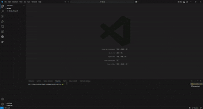
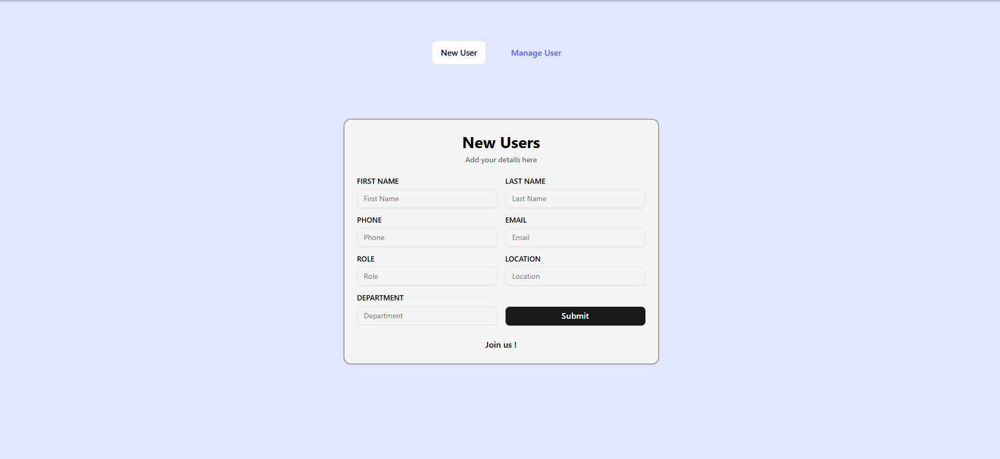
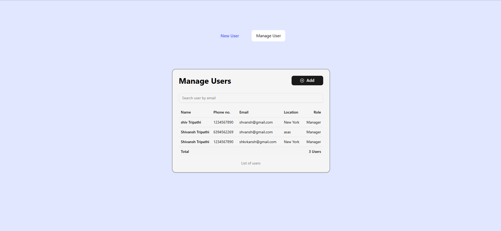
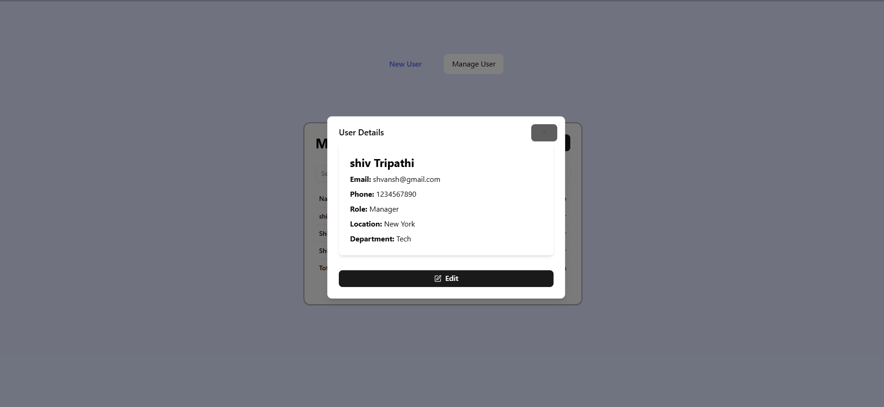
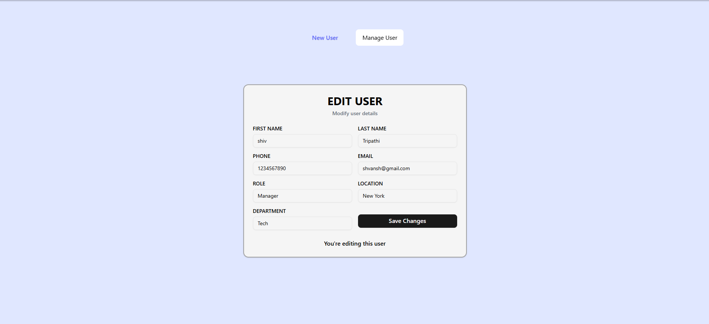

# Klimb User Management Frontend

This project is a user management frontend built with React, TypeScript, and Vite. It allows users to add new user details, manage existing users, view user information, and edit user data.
If Your are Using VSCode please press Ctrl+Shift+V to open the markdown preview feature to easily read this file
## Demo

[](./src/assets/GIF/demo.gif)

## Figma Design

You can view the design mockups for this project on Figma:

[Link to my Figma Design](https://www.figma.com/design/Ou5L6g4L9aUYJnRxjRPsDk/Klimb?node-id=0-1&t=1ZpPAjTy5Uyv7ilI-1)

## Installation

1.  **Install Dependencies:**

    Navigate to the project directory (likely `Klimb_Shivansh`):

    ```bash
    cd Klimb_Shivansh
    npm install
    ```

    [](./src/assets/GIF/installation.gif)
    *(Replace `./path/to/installation-demo.gif` with the actual path to your installation demonstration GIF)*

2.  **Run the Development Server:**

    Inside the `Klimb_Shivansh` folder, run the development server:

    ```bash
    npm run dev
    ```

    This will start the Vite development server, and you can usually access the application at a local URL (e.g., `http://localhost:5173`).

## Application Pages

Here's a breakdown of the key pages and their functionalities:

### 1. Landing Page / New User Form

[](./src/assets/screenshots/new-user.png)

This page provides a form for adding new users to the system. The form includes fields for:

* FIRST NAME
* LAST NAME
* PHONE
* EMAIL
* ROLE
* LOCATION
* DEPARTMENT

Users can input the details for a new user and submit the form to add them to the global user state.

### 2. Manage Users Page

[](./src/assets/screenshots/manage-user.png)

This page displays a list of existing users in a table format. Key features include:

* **User Search:** An input field allows users to search for users by their email address.
* **User Details:** Clicking on a row in the table opens a dialog box displaying detailed information about the selected user.
* **Add New User Button:** A button allows navigation or direct access to the "New User" form.

### 3. User Details Dialog

[](./src/assets/screenshots/user-details.png)

This dialog appears when a user clicks on a row in the "Manage Users" table. It presents a detailed view of the selected user's information, including:

* Name
* Email
* Phone
* Role
* Location
* Department

The dialog also includes an "Edit" button to navigate to the "Edit User" page for the current user.

### 4. Edit User Page

[](./src/assets/screenshots/edit-user.png)

This page allows users to modify the details of an existing user. It contains pre-filled form fields with the current user's information, enabling users to update and save changes.

## Global State Management with Zustand

This frontend utilizes **Zustand** for global state management. Zustand provides a simple and effective way to store and share data across your entire application. A central "store" manages the application-wide data.

In this project, Zustand is used to store the **`users`** array. This array holds all the user objects, where each object contains properties like `name`, `email`, `location`, `role`, and `department`.

Any component can easily access and update this global `users` array. Zustand allows components to "subscribe" to the store, automatically re-rendering whenever the user data changes. This simplifies data sharing and management across the application.

## User Search Functionality

The user search on the "Manage Users" page allows filtering the user list by email. As the user types in the search input, the displayed list of users is dynamically updated to show only those whose email addresses contain the entered text. This filtering is done in real-time, providing a quick way to find specific users. A dropdown of matching email suggestions is also displayed as the user types, further aiding the search process.